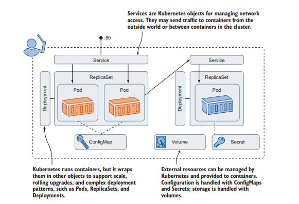

# 1.1 Understanding Kubernetes

-   Two core concepts in Kubernetes

    1. API which define your applications
    2. Cluster which runs your applications

-   Cluster is a set of individual servers that have all been configured with a container runtime like Docker, and then joined into a single logical unit with Kubernetes.

-   Applications are defined in YAML files and deployed by sending the YAML to the cluster
-   Defining structure of the application is your job, running and managing everything is down to Kubernetes.

-   Kubernetes manages more than just containers,
    -   cluster has a distributed database which can store both config files and secrets
    -   also provides storage, so your applications can maintain data outside of containers
    -   kubernetes also manages network traffic coming into the cluster

Overview of kubernetes terms

