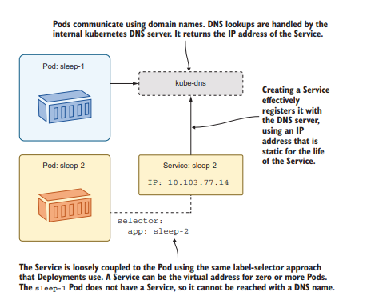
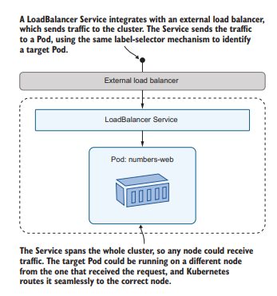

# Connecting Pods over the network with Services

<br>

# 3.1 How Kubernetes routes network traffic

Example

```
# start up your lab environment—run Docker Desktop if it's not running—
# and switch to this chapter’s directory in your copy of the source code:
cd ch03

# create two Deployments, which each run one Pod:
kubectl apply -f sleep/sleep1.yaml -f sleep/sleep2.yaml

# wait for the Pod to be ready:
kubectl wait --for=condition=Ready pod -l app=sleep-2

# check the IP address of the second Pod:
kubectl get pod -l app=sleep-2 --output
jsonpath='{.items[0].status.podIP}'

# use that address to ping the second Pod from the first:
kubectl exec deploy/sleep-1 -- ping -c 2 $(kubectl get pod -l app=sleep-2 --output jsonpath='{.items[0].status.podIP}')

```

-   The problem of needing a permanent address for resources that can change is an old
    one—the internet solved it using DNS (the Domain Name System), mapping friendly
    names to IP addresses
-   A Kubernetes cluster has a DNS server built in, which maps Service names to IP addresses



-   This type of Service is an abstraction over a Pod and its network address
-   Similar to Deployment being an abstraction over a Pod and its container.
-   Service has its own IP address which is static

Example Service Manifest

```
apiVersion: v1 # Services use the core v1 API.
kind: Service

metadata:
 name: sleep-2 # The name of a Service is used as the DNS domain name

# The specification requires a selector and a list of ports.
spec:
 selector:
 app: sleep-2 # Matches all Pods with an app label set to sleep-2.
 ports:
 - port: 80 # Listens on port 80 and sends to port 80 on the Pod

```

<br>

# 3.2 Routing traffic between pods

-   The default type of Service in Kubernetes is called ClusterIP
-   The IP address works only within the
    cluster, so ClusterIP Services are useful only for communicating between Pods.

```
# Example of client and api with service

# run the website and API as separate Deployments:
kubectl apply -f numbers/api.yaml -f numbers/web.yaml

# wait for the Pod to be ready:
kubectl wait --for=condition=Ready pod -l app=numbers-web

# forward a port to the web app:
kubectl port-forward deploy/numbers-web 8080:80

# browse to the site at http://localhost:8080 and click the Go button
# —you'll see an error message
# exit the port forward:
ctrl-c


# deploy the Service from listing 3.2:
kubectl apply -f numbers/api-service.yaml

# check the Service details:
kubectl get svc numbers-api

```

<br>

## 3.3 Routing external traffic to pods

-   use a type of Service called `LoadBalancer`
-   another way to look at service is that it communicate from Pods to components outside of the cluster



Example manifest

```
apiVersion: v1
kind: Service
metadata:
 name: numbers-web
spec:
 ports:
 - port: 8080 # The port the Service listens on
 targetPort: 80 # The port the traffic is sent to on the Pod
 selector:
 app: numbers-web
 type: LoadBalancer # This Service is available for external traffic.


```

Applying

```
# deploy the LoadBalancer Service for the website—if your firewall checks
# that you want to allow traffic, then it is OK to say yes:
kubectl apply -f numbers/web-service.yaml

# check the details of the Service:
kubectl get svc numbers-web

# use formatting to get the app URL from the EXTERNAL-IP field:
kubectl get svc numbers-web -o jsonpath='http://{.status.loadBalancer.ingress[0].*}:8080'

```

Node Ports (Not widely used)

-   There is a Service type you can use that listens for network traffic coming into the cluster and directs it to a pod, the `NodePort`
-   `NodePort` services do not require an external load balancer. Every node in the cluster listens on the port specified in the Service and sends traffic to the target port on the pod.

<br>

## 3.4 Routing Traffic outside Kubernetes

-   Using an `ExternalName` Service lets you use local cluster addresses for remote components
-   `ExternalName` Services can be a useful way to deal with differences between environments that you cannot work around in your app configuration.

# stop at page 77
